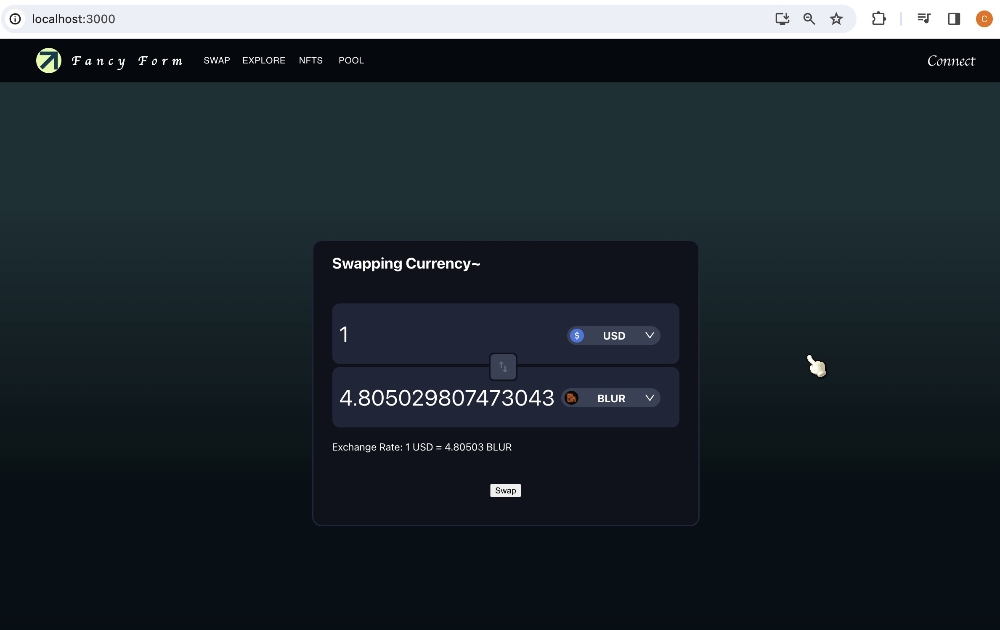

# Problem 2: Fancy Form
Estimated Time Taken: 20 hours

In the project directory, you can run:

### `npm start`

Runs the app in the development mode.\
Open [http://localhost:3000](http://localhost:3000) to view it in your browser.

The page will reload when you make changes.\
You may also see any lint errors in the console.

if any error occurs the following commands can be ran:
### `sudo rn -rf node_modules`
### `npm install`
### `npm start`