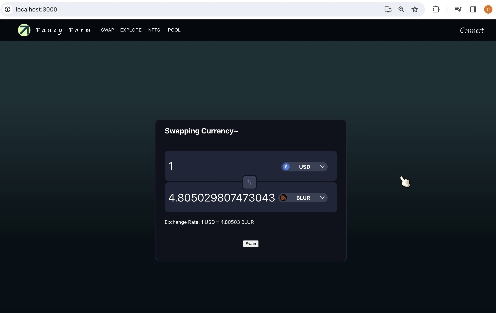

Chong Wen Rong, Chelson

Application for FrontEnd Engineer Intern

# Problem 1: 3 Ways to sum n
Estimated Time Taken: 20mins~

## Method 1: 
### Using a for loop, this method simply iterates from 1 to n and stores in variable sum that will be returned.
### Advantages: easy to read and understand

## Method 2:
### Using a Recursion. First the method will check if n=1, and returns if it is. Otherwise, it will return the sum of all numbers.
### Advantages: Looks elegant, may perform better for larger methods

## Method 3: 
### Utilizing a mathematical formula (n * (n+1)) / 2.
### Advantages: Supposedly the most efficient

# Problem 2: Fancy Form
Estimated Time Taken: 20 hours

In the project directory, you can run:

### `npm start`

Runs the app in the development mode.\
Open [http://localhost:3000](http://localhost:3000) to view it in your browser.

The page will reload when you make changes.\
You may also see any lint errors in the console.

if any error occurs the following commands can be ran:
### `sudo rn -rf node_modules`
### `npm install`
### `npm start`

# Problem 3: Messy React
Estimated Time Taken: 4.5 hours~

Ammendment 1: Make FormattedWalletBalance an extension from WalletBalance

Ammendment 2: BoxProps should extend Props, since BoxProps is more specific.

Ammendment 3: Run only once on mount

Ammendment 4: Combine the if conditions together

Ammdenment 5: Ddded missing condition where rightPriority = leftPriority

Ammdendment 6: Format directly within JSX for efficiency, but not so sure if i got it right....

Task 2: Creating the class Datasource